class: center, middle

# About the course

---

## About the course

Authors of this course:

1. Konstantin Zaitsev, https://www.researchgate.net/profile/Konstantin_Zaitsev, https://stepik.org/course/512/
2. Alexander Tkachenko, https://publons.com/researcher/3041889/alexander-tkachenko/, https://stepik.org/course/94/

---

## About the course

* Course is scientific-oriented
* By “gene expression” we almost always mean “RNA expression” if not said otherwise
* Course will take place in Zoom

Most important link: https://drive.google.com/drive/folders/1XvE5leRSwm1HEU6HP8MVAkkj48BobicD

---

## About the course: prerequisites

* You are expected to be able to use google
* You are expected to be able to read documentation / papers
* You will be given access to a machine with all the packages installed
* 4 homeworks which you will have to defend ( in person (?) )

https://drive.google.com/drive/folders/1XvE5leRSwm1HEU6HP8MVAkkj48BobicD
 
---

## About the course: syllabus

.tiny[
* Central dogma of molecular biology, structure of gene, types of RNA, structure of RNA, transcription, reverse transcription, qPCR, FISH, FACS
* Microarray: quantification, normalization, basic analysis
* RNA-seq: alignment, quantification, QC, normalization, basic analysis
* Overall quality control: PCA, clustering, outlier detection
* Overall quality control: batch correction
* Differential expression (DE): limma for microarray, Deseq2 for RNA-seq
* Downstream analysis: pathway/gene set enrichment analysis
* Downstream analysis: gene expression deconvolution
* Transcriptome assembly, functional annotation
* Single-cell transcriptomics: Seurat basic analysis
* Single-cell transcriptomics: Trajectory analysis, RNA velocity, optimal transport
* Visual data exploration: phantasus, JBR genome browser
* Experimental design of gene expression study

]

https://drive.google.com/drive/folders/1XvE5leRSwm1HEU6HP8MVAkkj48BobicD
 
---

class: center, middle

# Measuring RNA abundance

---

## Why we measure RNA abundance

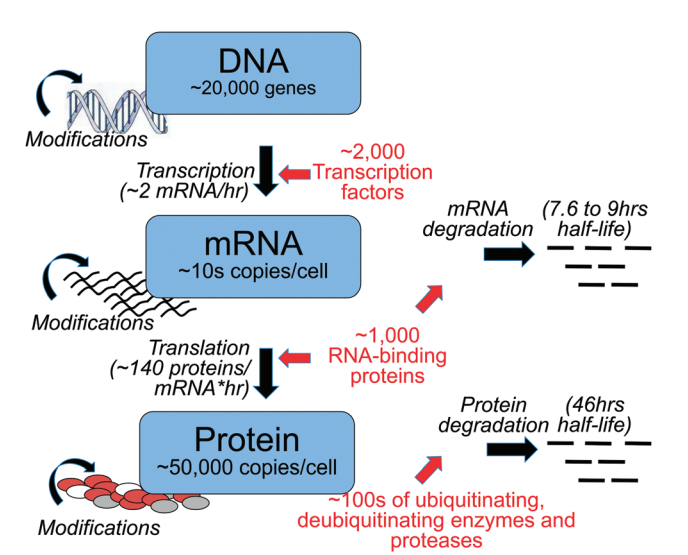

Taken from https://www.ncbi.nlm.nih.gov/pubmed/26259698
 

---
## Why we measure RNA abundance

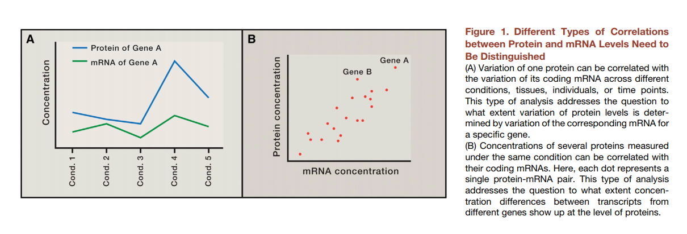

Taken from https://www.cell.com/cell/pdf/S0092-8674(16)30270-7.pdf
 

--

* A is very often the case
* B is almost never the case

---
## Why we measure RNA abundance

* While proteins are the key players in biological processes, RNA abundance is a good enough approximation for protein abundance

* Measuring RNA abundance is **much easier**

* Given several conditions and a gene: for <strong class='red'>the same gene</strong> fold change in RNA abundance will inform us about fold change in protein level
---
## Structure of mRNA

* We are mostly interested in mRNA (messenger RNA), because it is protein coding RNA
* Estimated 105 to 106 mRNA molecules per animal cell with high dynamic range for genes: from several copies to 104

https://www.ncbi.nlm.nih.gov/pmc/articles/PMC3129258/
 and https://bionumbers.hms.harvard.edu/bionumber.aspx?id=111220
 

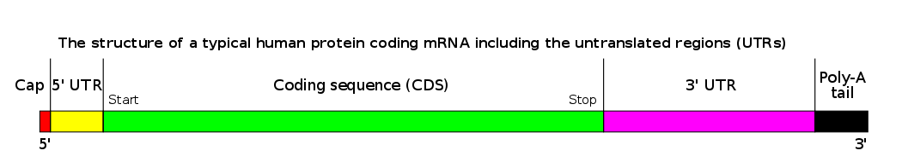

---
## Types of RNA

* rRNA - ribosomal RNA: 80% of total cell RNA
* tRNA - transfer RNA: 15% of the cell RNA
* mRNA - messenger RNA for protein-coding genes
* Others RNAs: miRNA, lncRNA

---
## Strategies to capture RNA

|Strategy         |	Type of RNA	    | Ribosomal RNA content	 | Unprocessed RNA content	| Genomic DNA content | Isolation method                                             |
|:----------------|:---------------:|:----------------------:|:------------------------:|:-------------------:|:------------------------------------------------------------:|
|Total  RNA       |All	            | High                   |High	                    |High	                |   None                                                       |
|PolyA selection	|Coding           |	Low	                   |Low	                      |Low	                |Hybridization with poly(dT) oligomers                         |
|rRNA depletion	  |Coding, noncoding|	Low	                   |High	                    |High	                |Removal of oligomers complementary to rRNA                    |
|RNA capture	    |Targeted	        | Low	                   |Moderate	                |Low	                |Hybridization with probes complementary to desired transcripts|

---

## Why we measure RNA abundance

What can be a sample? RNA isolated from pretty much anywhere

* Blood draw
* Tissue / organ
* Specific isolated cell type

---

## Gene expression studies

* Usually you have the phenotype, but you don't know why it happens
* You take samples from several conditions related to your phenotype
* You try to figure out what is different in your phenotype from the control (or other condition)

---

## Berry et al, 2010

.center[
  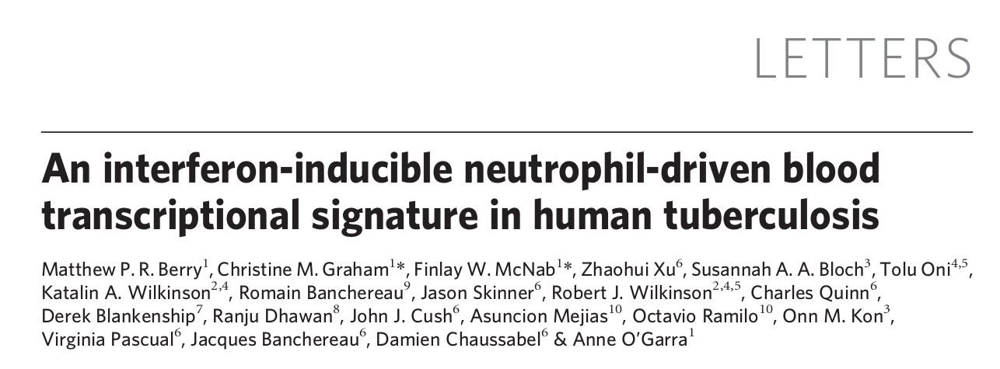
]

Taken from https://www.nature.com/articles/nature09247
 

---

## Berry et al, 2010

.center[
  
]

"Most people infected with M. tuberculosis remain asymptomatic, termed latent TB, with a 10% lifetime risk of developing active TB disease. Current tests, however, cannot identify which individuals will develop disease."

Taken from https://www.nature.com/articles/nature09247
 

---

## Berry et al, 2010

* Here we identify a whole-blood 393 transcript signature for active TB in intermediate and high-burden settings, correlating with radiological extent of disease and reverting to that of healthy controls after treatment
* A subset of patients with latent TB had signatures similar to those in patients with active TB
* We also identify a specific 86-transcript signature that discriminates active TB from other inflammatory and infectious diseases

Taken from https://www.nature.com/articles/nature09247
 

---

## Berry et al, 2010

.center[
  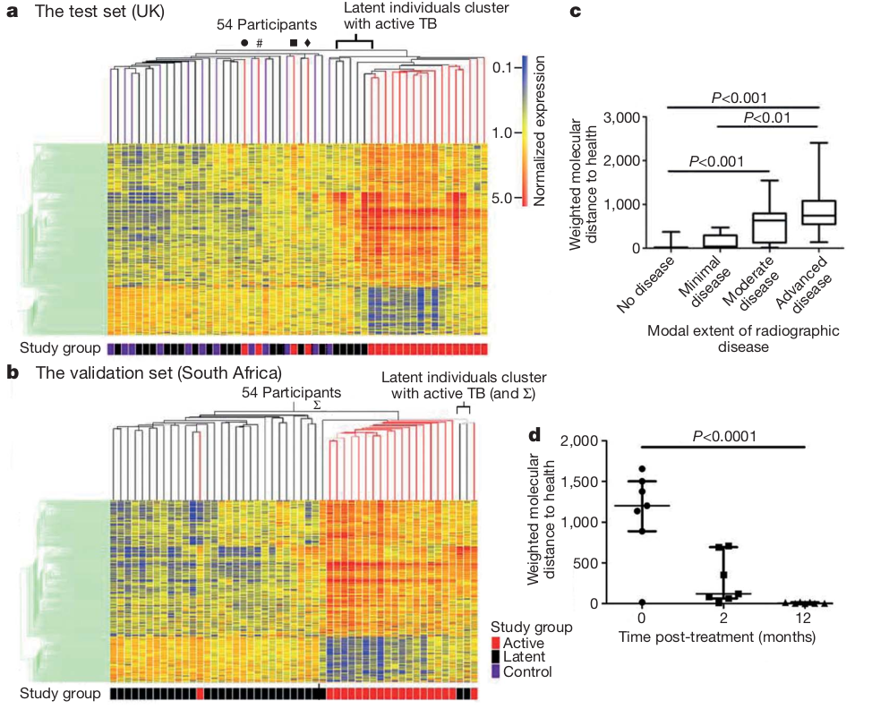
]

Taken from https://www.nature.com/articles/nature09247
 

---

## Berry et al, 2010

.center[
  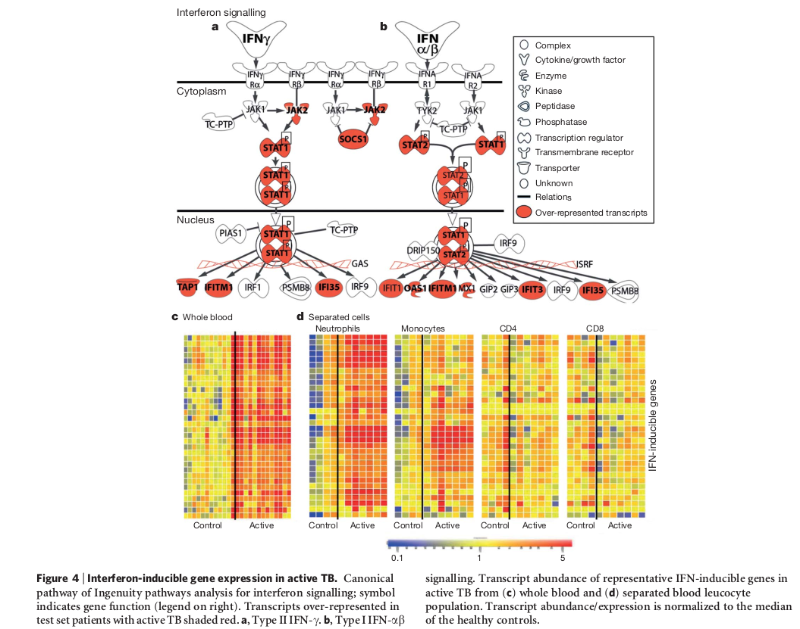
]

Taken from https://www.nature.com/articles/nature09247
 

---

## Berry et al, 2010

.center[
  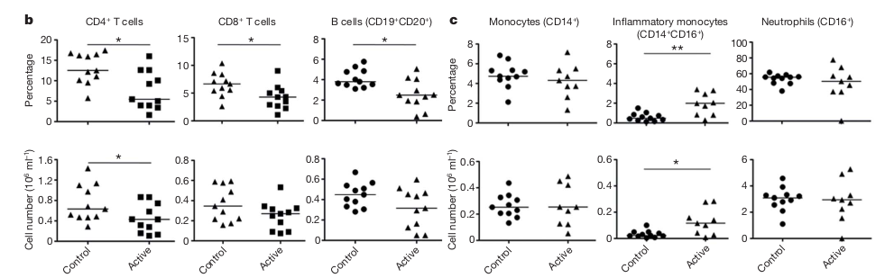
]

Taken from https://www.nature.com/articles/nature09247
 

---

## How do we know what's diffent

Main word behind comparative gene expression studies is **differential expression** (DE). 

* Given two conditions *A* and *B* 
* We try to find genes for which we can statistically confirm that their average expression level in these two conditions is different

Briefly speaking, differential expression tests are statistical frameworks to identify genes of possible interest.

We say that gene is differentially expressed, when they have different average expression levels (between conditions).

---
## What else

* Previous example was about gene expression on a **gene level**
* We can go to **transcript level** and detect different isoforms

---

class: center, middle

# Alternative splicing

---

## Terminology

* Alternative splicing, alternative transcription start- and termination sites
* All of the above we wall alternative splicing
* All of the above events expend RNA repertoire of most human genes

---

## Isoform switch

* Isoform switch is one of alternative splicing scenarios
* Under certain condition, gene is spliced differently

.center[
  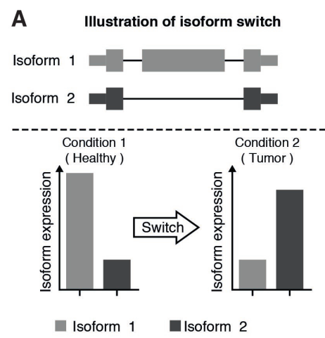
]

Taken from https://mcr.aacrjournals.org/content/15/9/1206.figures-only
 
---

## Isoform switch

.center[
  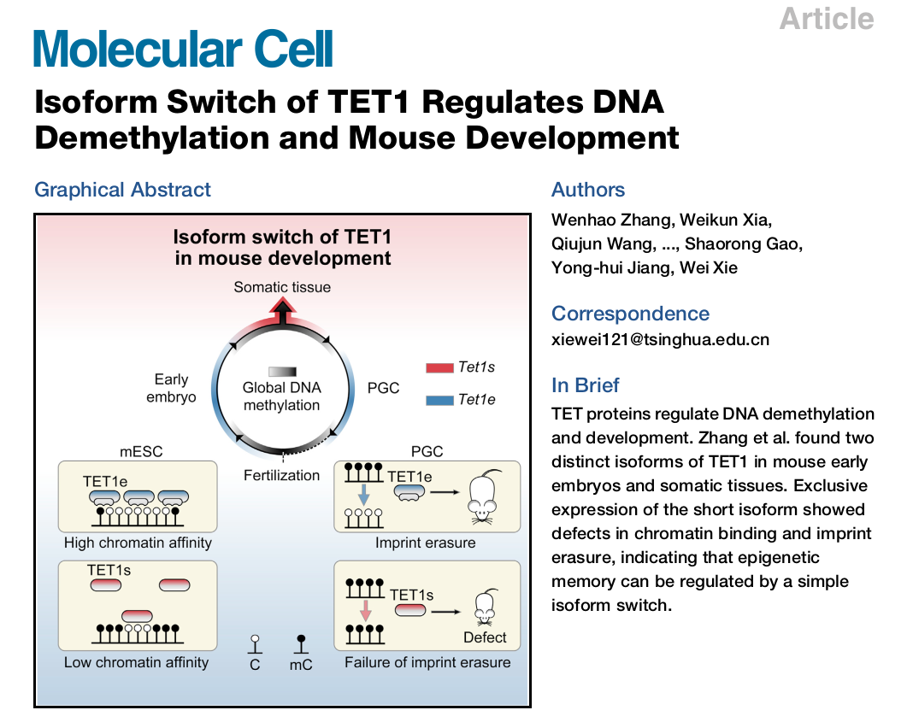
]

Taken from https://www.ncbi.nlm.nih.gov/pubmed/27916660
 

---

## Isoform switch

.center[
  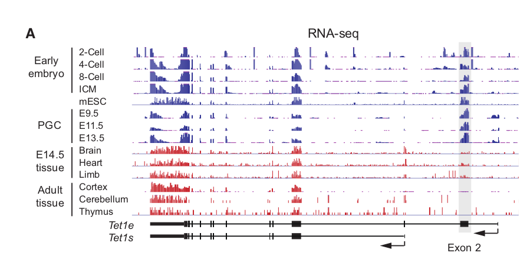
]

Taken from https://www.ncbi.nlm.nih.gov/pubmed/27916660
 

---

## Isoform switch

.center[
  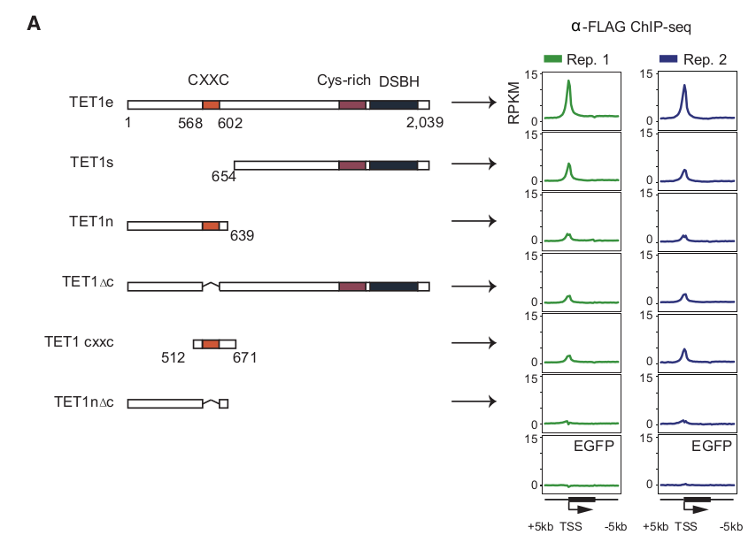
]

Taken from https://www.ncbi.nlm.nih.gov/pubmed/27916660
 

---

## What else

* Mouse and human (I mostly work with) are very well annotated
* What if the organism of interest is not well-studied?

---

class: center, middle

# Transcriptome assembly and functional annotation

---

## Transcriptome assembly

* RNA-Seq Assembly is an identification of all expressed isoforms from RNA-seq
* Reference-guided Transcriptome assembly
* De novo RNA-seq Assembly

---

## Functional annotation

* Predicting gene/transcript function
* Homology search to known sequence data
* Protein domain identification
* Protein signal peptide and transmembrane domain prediction 

---

## Example study

.center[
  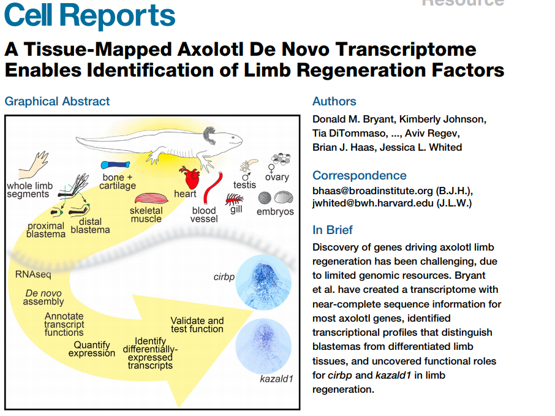
]

Taken from https://www.cell.com/action/showPdf?pii=S2211-1247%2816%2931770-3
 
---

## Example study

.center[
  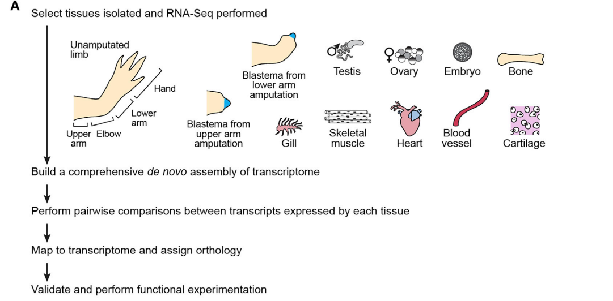
]

Taken from https://www.cell.com/action/showPdf?pii=S2211-1247%2816%2931770-3
 
---

## Example study

.center[
  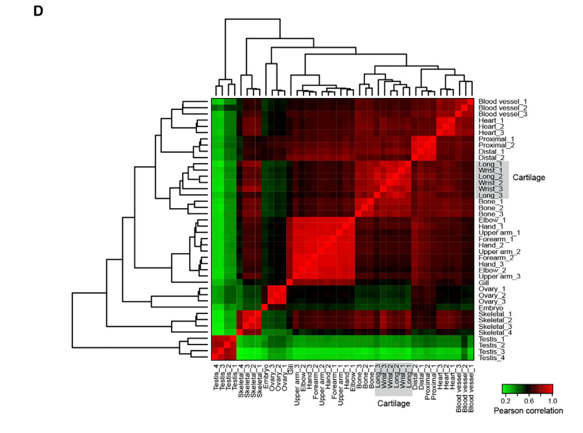
]

Taken from https://www.cell.com/action/showPdf?pii=S2211-1247%2816%2931770-3
 
---

class: center, middle

# Single-cell technologies

---

## Single-cell RNA-seq

* These days we can measure RNA abundance within single cells
* Better resolution: more samples (cells), better understanding where changes are coming from
* Worse resolution: we have much less RNA within a single cell than within a sample. We can capture even less. We can sequence even less

---

## Single-cell RNA-seq

.center[
  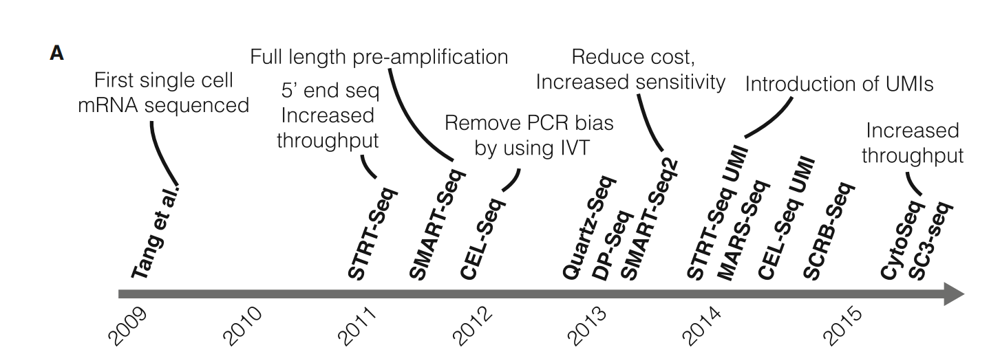
]

Taken from https://www.cell.com/action/showPdf?pii=S1097-2765%2815%2900261-0
 
---

## Single-cell RNA-seq

.center[
  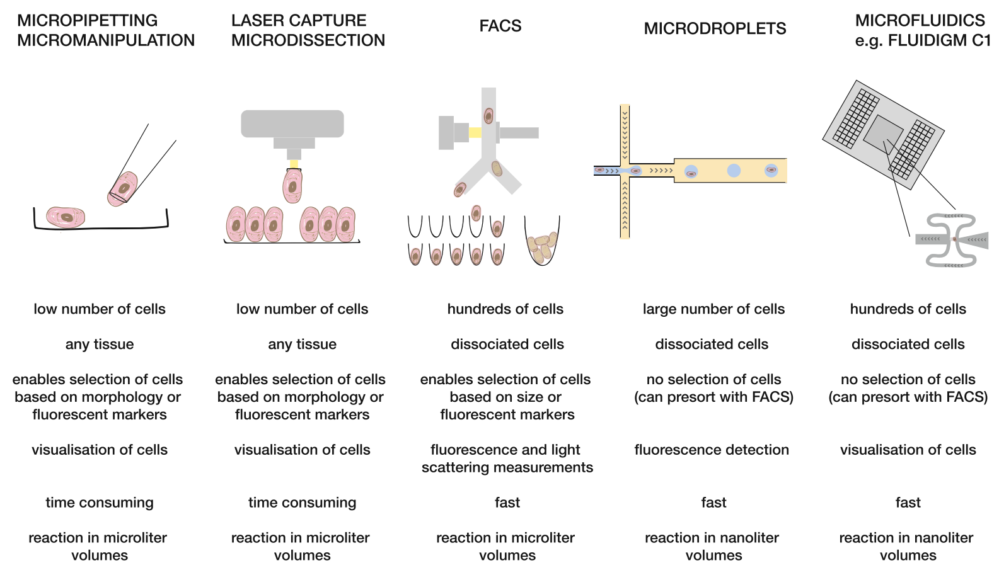
]

Taken from https://www.cell.com/action/showPdf?pii=S1097-2765%2815%2900261-0
 
---
## Single-cell RNA-seq

.center[
  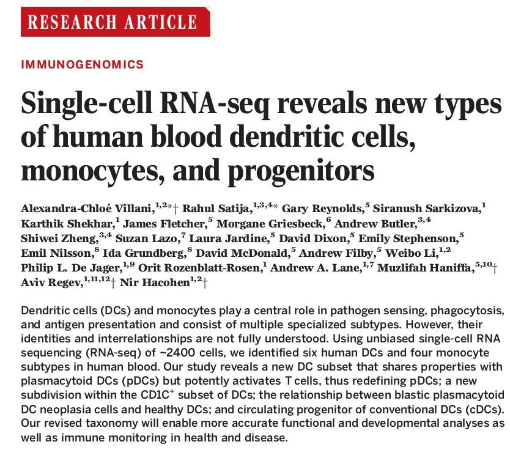
]

Taken from https://science.sciencemag.org/content/356/6335/eaah4573
 

---

## Single-cell RNA-seq

.center[
  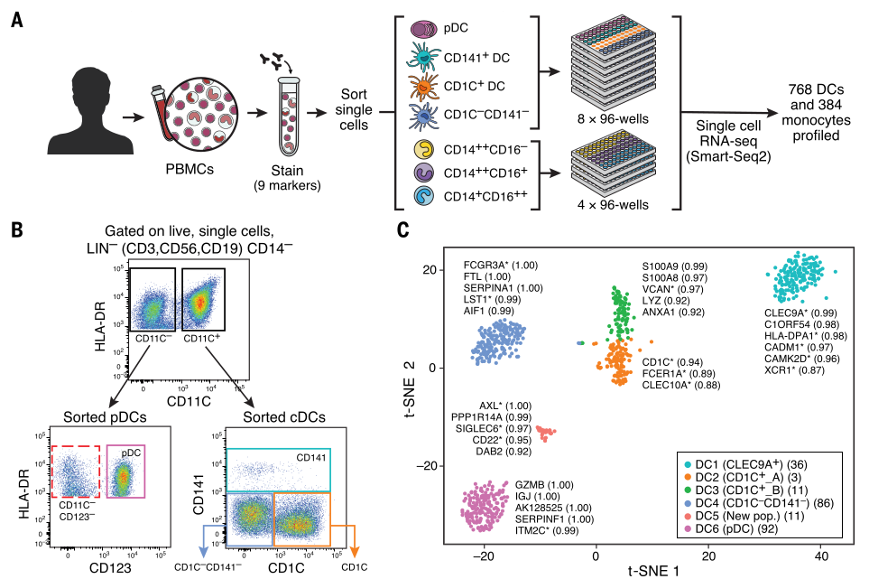
]

Taken from https://science.sciencemag.org/content/356/6335/eaah4573
 

---

## Single-cell RNA-seq

.pull-left[

* Performed scRNA-seq on myeloid blood cells
* Compared existed classification with their findings
* Identified new subsets

]

.pull-right[
  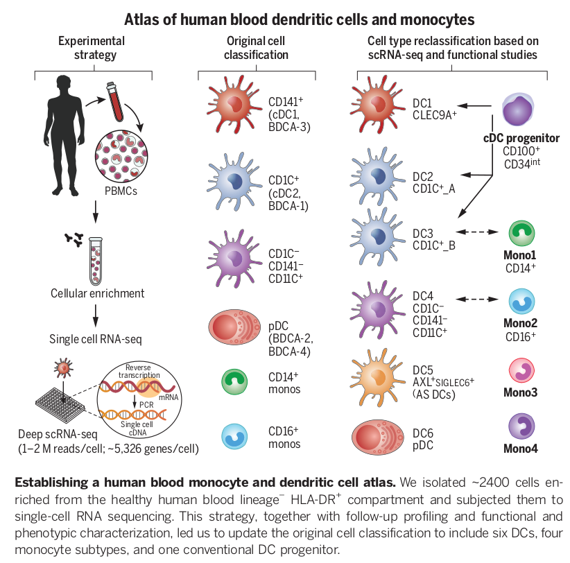
]

Taken from https://science.sciencemag.org/content/356/6335/eaah4573
 

---

class: center, middle

# Structure of the course

---

## Day 1: Transcription and regulation of transcription

* **Alexander Tkachenko** will walk you through transcription and remind you the biology behind transcription and how transcription can be regulated.

---

## Day 2: Microarray and gene expression studies

* Microarrays and how they measure RNA abundance
* You will be introduced to basic concepts and ideas in gene expression studies
* Secondary analysis of gene expression datasets
* **Homework 1**: Analysis of microarray dataset

---

## Day 3: RNA-seq

* Sequencing of RNA
* Alignment / quantification
* Normalization and differential expression
* **Homework 2**: Alignment and quantification of RNA-seq dataset with further downstream analysis

---

## Day 4: Different topics

* Non-model species: transcriptome assembly
* Gene expression deconvolution
* Experimental design of RNA-seq studies
* **Homework 3**: Transcriptome assembly
---

## Day 5: Single-cell transcriptomics

* Single-cell RNA-seq
* Methods in scRNA-seq
* Visual data analysis
* **Homework 4**: Analysis of scRNA-seq dataset
---

## Why this way?

* We will cover things mostly in chronological order
* Basic models and frameworks will get more complicated as we get through

---

## Grading the course

Homeworks (during this week):

* 4 homeworks (50 points)

Examination is somewhere in May:

* Dataset processing as a part of examination (25 points)
* Oral examination (25 points)

---

## Grading the course

* \>= 50 is E (all homeworks will give you E)
* \>= 60 is D 
* \>= 70 is C 
* \>= 80 is B 
* \>= 90 is A (that's where you aim)

---

class: center, middle

# Any questions ?

