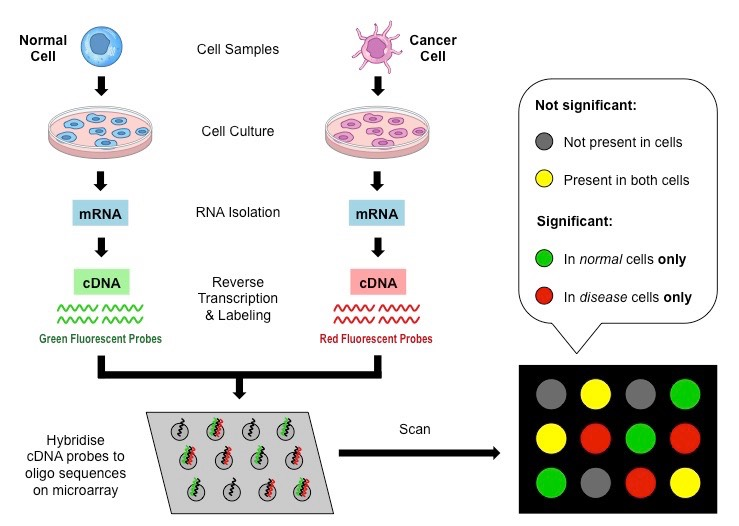
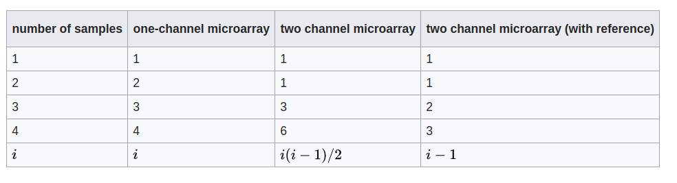
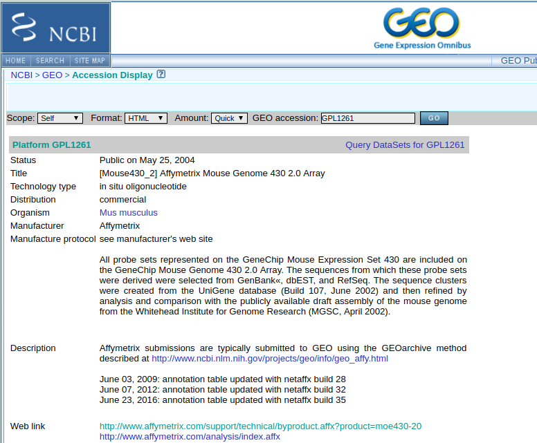

class: center, middle

# Microarrays

---
class: center, middle

# Materials are at

/mnt/data/microarray


---


## Installing libraries for today

```{r warning=F, message=F}
if (!requireNamespace("BiocManager", quietly = TRUE)) install.packages("BiocManager")
if (!requireNamespace("affxparser", quietly = TRUE)) BiocManager::install("affxparser")
if (!requireNamespace("affy", quietly = TRUE)) BiocManager::install("affy")
if (!requireNamespace("GEOquery", quietly = TRUE)) BiocManager::install("GEOquery")
if (!requireNamespace("mouse4302.db", quietly = TRUE)) BiocManager::install("mouse4302.db")

```

---

## DNA Microarray

* **DNA Microarray** is a collection of microscopic **DNA spots** attached to a solid suface
* **DNA spot** contains copies of specific DNA sequence called **probes** (or oligoes)
* DNA probe is usually specific for a certain DNA region of certain mRNA
* DNA probe hybridizes with complement fluorescent labeled DNA (cDNA) molecule
* After that we can detect fluorescence

---

## DNA Microarray: usages

* Genotyping: allele specific probes
* Tiling array: you can cover (like a whole chromosome) with overlapping probes to detect expression levels and coverage
* **Gene expression**: if probes are specific for different gene regions -- we can measure relative abundance of RNA within the sample
* Many other

---
## Microarray: gene expression

* Microarray can be considered as RNA capture technique
* Microarray consists of thousands of probes
* Probes consist of many oligonucleotides (all of which are the same within the probe)
* When cDNA hybridizes with complementary oligonucleotides, we detect fluoresence

---
## Microarray


<div class="my-footer"><span>Taken from https://en.wikipedia.org/wiki/DNA_microarray</span></div> 
---
## Microarray

.center[
  
]

<div class="my-footer"><span>Taken from https://ib.bioninja.com.au/options/untitled/b4-medicine/dna-microarrays.html</span></div>


---

## Historical remark

* Researchers **used to do two-color microarray**: two samples could be processed with the same DNA chip
* Now most of the array are done in single-color: chips are relatively cheap
* But the legacy is huge: 
  * people still do red-green heatmaps
  * all the schematics for microarray will be in red-green colors
  * GEO datasets still use green-magenta color-scheme

---

## Historical remark

* You don't benefit much from two-channel microarray when working with larger number of samples

.center[
  
]

<div class="my-footer"><span>Taken from https://en.wikipedia.org/wiki/DNA_microarray</span></div>


---

## Dataset for today: GSE129260

https://www.ncbi.nlm.nih.gov/geo/query/acc.cgi?acc=GSE129260

In short:
* B cells
* IL10 positive and negative
* Treated with LPS and anti-CD40
* In total four groups, two replicates in each group

---


## Affymetrix microarrays

Most likely, microarray gene expression data will come from affymetrix microarray.

.center[
  
]


<div class="my-footer"><span>Taken from ttps://www.ncbi.nlm.nih.gov/geo/query/acc.cgi?acc=GPL1261</span></div>

---

## Raw microarray files

Different microarray platforms have different specifications about:
* What are the probes
* Where probes are physically located on the chip
* This is usually desrcribed in CDF file (Chip Description File)

---

## Raw microarray files

Raw files for microarray are just fluorescence itensities for a chip (CEL files).

So if you are running microarray from scratch you will have:
* CEL file for each sample
* CDF file for your microarray platform

---

## Raw microarray files: time for some code

```{r cache=TRUE, warning=F, message=F}
library(affxparser)
library(affy)

CELfile <- readCel("GSE129260_RAW/GSM3703675_IL-10_posi_anti-CD40-1.CEL")

```

---

## Raw microarray files: time for some code

```{r } 
head(CELfile$header)
```

---

## Raw microarray files: time for some code

```{r } 
head(CELfile$intensities)
```

---
## Converting CEL to features

In most cases we don't need to do that ourselves.

**IN MOST CASES YOU REALLY DON'T WANT TO DO THAT**

---

## Realistically

Affymetrix arrays come with tools to:
* Get the feature expression values
* Normalize expression levels
* These tools are standartized and available in Bioconductor

---

## Public data

```{r cache=TRUE, suppressMessages=TRUE}
files <- list.files("GSE129260_RAW/", full.names = T)
microarrayData <- justRMA(filenames = files)
```
---

## Public data

```{r cache=TRUE}
exprs(microarrayData)[1:5, 1:2]
```
---

## Normalization

* Raw Affy data contains about twenty probes for the same RNA target
* Half of these are "mismatch spots", which do not precisely match the target sequence 
* These can theoretically measure the amount of nonspecific binding for a given target

---

## Normalization

* Robust Multi-array Average (**RMA**) is a normalization approach that does not take advantage of these mismatch spots, but still must summarize the perfect matches through median polish
* The current Affymetrix **MAS5** algorithm, which uses both perfect match and mismatch probes, continues to enjoy popularity and do well in head to head tests

---

## How to get symbols ?

```{r message=F}
library(mouse4302.db)

symbolAnnotation <- as.list(mouse4302SYMBOL)
head(symbolAnnotation, 3)

```

---

## Public data: GEOquery

We have much easier ways to get annotation for samples/probes with GEOquery

```{r message=F, cache=T}

library(GEOquery)
GSE129260 <- getGEO("GSE129260", AnnotGPL = TRUE)[[1]]

```

---
## Public data: GEOquery

```{r message=F}
dim(exprs(GSE129260))

```
---

## Public data: GEOquery

```{r message=F}
head(exprs(GSE129260))

```
---
## Public data: GEOquery

```{r message=F}

head(pData(GSE129260)[, 1:2])

```


---
## Public data: GEOquery

```{r message=F}

head(fData(GSE129260)[, 1:2])

```