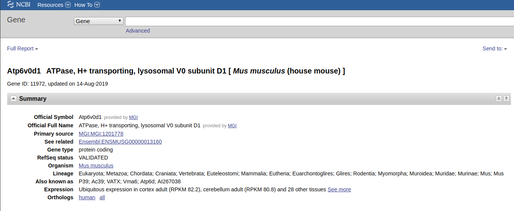

class: center, middle

# Microarrays

---
## Installing libraries for today

```{r message=F}
if (!requireNamespace("BiocManager", quietly = TRUE)) install.packages("BiocManager")
if (!requireNamespace("GEOquery", quietly = TRUE)) BiocManager::install("GEOquery")
if (!requireNamespace("Biobase", quietly = TRUE)) BiocManager::install("Biobase")
if (!requireNamespace("ggplot2", quietly = TRUE)) install.packages("ggplot2")
if (!requireNamespace("reshape2", quietly = TRUE)) install.packages("reshape2")
if (!requireNamespace("limma", quietly = TRUE)) BiocManager::install("limma")
if (!requireNamespace("MASS", quietly = TRUE)) install.packages("MASS")

library(GEOquery)
library(Biobase)
library(ggplot2)
library(reshape2)
library(limma)
library(MASS)
```

---
## Loading the dataset

```{r cache=T, message=F}

GSE129260 <- getGEO("GSE129260", AnnotGPL = TRUE)[[1]]

```

---

## fData and pData

* fData -- feature data,  probe annotation
* pData -- phenotypcal data, sample annotaiton

Lets filter these objects and only keep things we need

---

## Filtering pdata

This one is relatively straightforward

```{r message=F}
pData(GSE129260)$rep <- gsub(".*(rep\\d)$", "\\1", pData(GSE129260)$title)
pData(GSE129260) <- pData(GSE129260)[, c("characteristics_ch1.1", "characteristics_ch1.2", "rep")]

colnames(pData(GSE129260)) <- c("Cell", "Treatment", "Replicate")
head(pData(GSE129260))

```

---

## Filtering fdata

What do we want to keep?

```{r cache=T, message=F}
colnames(fData(GSE129260))

```

---

## Gene IDs: we are doomed

* **Gene symbol** - something meaningfull
* **Entrez ID** - https://www.ncbi.nlm.nih.gov/gene/ENTREZ_ID
* **ENSEMBL** -- just ENSEMBL, when you do RNA-seq, these IDs will show up
* RefSeq ID
* And many more

(I wanted to make a meme first, but gene id conversion is not funny at all)

---

## Filtering fdata

Lets keep ID, symbol, and entrez id

```{r message=F}
fData(GSE129260) <- fData(GSE129260)[, c("ID", "Gene symbol", "Gene ID")]
head(fData(GSE129260))

```

---

## Entrez ID

Entrez ID: https://www.ncbi.nlm.nih.gov/gene/11972

.center[
  
]

---

## Figuring out expression space

* Expression levels for each gene/probe can be in different space: linear and logarithmical space.
* Usually we determine that by looking at values (especially) maximum values
* If maximum value is < 25 we think it is in log-space
* If it is > 1000 we think it is in linear space
* (If it is somewhere in between we are usually confused)
* **Common mistake is to get log (log (value)) instead of just log(value)**
* Don't apply log to your data if it is already log-transformed

---

## Figuring out expression space

```{r fig.height=3, fig.fullwidth=T, dev='svg'}

ggplot(data=data.frame(expression=exprs(GSE129260)[, 1]),
       aes(x=expression)) +
  geom_histogram()

```

---

## Figuring out expression space

```{r fig.height=3, fig.fullwidth=T, dev='svg', message=F}

ggplot(data=data.frame(expression_log2=log2(exprs(GSE129260)[, 1])),
       aes(x=expression_log2)) +
  geom_histogram()

```

---

## Observations

* In microarray we don't have true "zeroes"

```{r}
min(exprs(GSE129260))
```
* This means that even for non-expressed probes we detect some light intensity (background fluorescence)
* In log-scale distribution of expression values usually looks "more normal"

---

## About expression space

* Most of gene expression studies are done in log-space (we believe that error is normally distributed in log-space)
* There are some exceptions (like gene expression deconvolution, usually is done in linear space)


---

## Comparing distributions between samples

```{r fig.height=3, fig.fullwidth=T, dev='svg', message=F}

twoSamples <- melt(exprs(GSE129260[, 1:2]))
twoSamples$value <- log2(twoSamples$value)

ggplot(data=twoSamples, aes(x=value)) +
  facet_grid(~Var2) + geom_histogram()

```
---

## Comparing distributions between samples

```{r }
colSums(exprs(GSE129260))
```

---

## Quantile normalization

* Distributions are similar yet different
* Better safe than sorry: we apply quantile normalization anyway
* https://en.wikipedia.org/wiki/Quantile_normalization

---

## Quantile normalization

```{r fig.height=3, fig.fullwidth=T, dev='svg', message=F}

exprs(GSE129260) <- normalizeBetweenArrays(log2(exprs(GSE129260)+1), method="quantile")
twoSamples <- melt(exprs(GSE129260[, 1:2]))

ggplot(data=twoSamples, aes(x=value)) +
  facet_grid(~Var2) + geom_histogram()

```

---

## Moving to gene expression

* We were mostly looking at "probe-level" expression
* We would like to move to gene-level expression
* But what can happen to a probe?

---

## Moving to gene expression

Please run 

```{r eval=F}
head(fData(GSE129260), 1000)
```

---

## Moving to gene expression

* Let's remove **probes that map to several genes** (they are not measuring anything specific)
* Let's remove **probes that don't map to any gene** (they are not measuring anything useful)
* If several probes are mapped to the same gene we only take the probe with the highest average expression
* Let's only keep 12000 top expressed genes


---
## Moving to gene expression

```{r }
GSE129260 <- GSE129260[!grepl("///", fData(GSE129260)$`Gene symbol`), ]
GSE129260 <- GSE129260[fData(GSE129260)$`Gene symbol` != "", ]

fData(GSE129260)$mean_expression <- apply(exprs(GSE129260), 1, mean)
GSE129260 <- GSE129260[order(fData(GSE129260)$mean_expression, decreasing = TRUE), ]
GSE129260 <- GSE129260[!duplicated(fData(GSE129260)$`Gene ID`), ]
GSE129260 <- GSE129260[seq_len(12000), ]
dim(GSE129260)
```

---

## Whoray

* This matrix is finally something that we can analyze
* Let's do a PCA first and see how our samples are grouped

---

## PCA plot

```{r fig.height=3, fig.fullwidth=T, dev='svg', message=F}
pcas <- prcomp(t(exprs(GSE129260)), scale. = T)
plotData <- cbind(pcas$x[, 1:2], pData(GSE129260))
ggplot(plotData, aes(x=PC1, y=PC2, color=Cell, shape=Treatment)) +
  geom_point() + theme_bw() + theme(aspect.ratio = 1)

```

---

## PCA plot

```{r fig.height=3, fig.fullwidth=T, dev='svg', message=F}
ggplot(plotData, aes(x=PC1, y=PC2, color=Replicate, shape=Treatment)) +
  geom_point() + theme_bw() + theme(aspect.ratio = 1)

```

---

## Sanity check:

Maybe something is just misslabeled in GEO? Can we check Il10 expression?

```{r }
fData(GSE129260)[fData(GSE129260)$`Gene symbol` == "Il10", ]
```

```{r }
exprs(GSE129260)["1450330_at", ]
```

---

## Variance expained:

Usually we show variance explained by components

$$ Var = \sigma^2 $$

prcomp calculates standard deviation

---

## Variance explained

```{r fig.height=3, fig.fullwidth=T, dev='svg', message=F}
variance <- pcas$sdev^2
ggplot(data=data.frame(component=1:8, variance=variance),
       aes(x=component, y=variance)) +
  geom_point() + geom_line() + theme_bw()

```

---

## Variance explained: ratio

```{r fig.height=3, fig.fullwidth=T, dev='svg', message=F}
variance <- variance / sum(variance)
ggplot(data=data.frame(component=1:8, percent=variance * 100),
       aes(x=component, y=percent)) +
  geom_point() + geom_line() + theme_bw()

```

---

## Differential expression

```{r }

GSE129260.design <- model.matrix(~0+Cell+Treatment+Replicate, data=pData(GSE129260))
colnames(GSE129260.design) <- c("il10neg", "il10pos", "LPS", "rep2")

fit <- lmFit(GSE129260, GSE129260.design)

fit2 <- contrasts.fit(fit, makeContrasts(il10pos - il10neg, levels=GSE129260.design))
fit2 <- eBayes(fit2, trend = T)

de <- topTable(fit2, adjust.method="BH", number=Inf, sort.by = "P")

```

---

## Differential expression

```{r }
head(de)
```

---
## Differential expression

```{r }

GSE129260.design <- model.matrix(~0+Replicate+Treatment+Cell, data=pData(GSE129260))
colnames(GSE129260.design) <- c("rep1", "rep2", "LPS", "pos")

fit <- lmFit(GSE129260, GSE129260.design)

fit2 <- contrasts.fit(fit, makeContrasts(rep2-rep1, levels=GSE129260.design))
fit2 <- eBayes(fit2, trend = T)

de <- topTable(fit2, adjust.method="BH", number=Inf, sort.by = "P")

```

---

## Differential expression

```{r }
head(de)
```


---

## Let's dig a bit into theory
<span class="red"> Spoiler alert: i am just a prorammer / bioinformatician :) You might want to consult a proper statistician </span>

.center[
  
]

---

## Simple t-test

* DE is about comparing means of several groups
* Let's know forget about previous dataset
* Lets assume we have 3 A samples and 3 B samples
* We would like to compare A vs B

---

## Linear models: simulations

Lets assume we know true A and true B:

```{r }

trueAB <- matrix(c(
  1, 2, 3, 4, 5, 6, 7, 8, 9, 10,
  10, 9, 8, 7, 6, 5, 4, 3, 2, 1
), ncol=2)
colnames(trueAB) <- c("A", "B")
rownames(trueAB) <- paste0("Gene ", 1:10)
head(trueAB)

```

---

## Linear models: simulations

Let's create noisy replicates (we assume noise is equal)

```{r }

set.seed(1)
observed <- trueAB[, c(1, 1, 1, 2, 2, 2)]
colnames(observed) <- c("A1", "A2", "A3", "B1", "B2", "B3")
rownames(observed) <- paste0("Gene ", 1:10)
observed <- observed + rnorm(60)
head(observed)

```

---

## Linear models: simulations

Let's define linear model

```{r }

modelMatrix <- matrix(
  c(1, 1, 1, 0, 0, 0, 0, 0, 0, 1, 1, 1),
  ncol = 2
)
colnames(modelMatrix) <- c("A", "B")
rownames(modelMatrix) <- colnames(observed)
head(modelMatrix)

```

---

## Linear models: simulations

If we multiply matrices $trueAB$ and $modelMatrix^T$, we will get desired matrix. But without noise.

```{r }

trueAB %*% t(modelMatrix)

```

---

## Linear models: simulations

In reality we don't know true answer, and we would like to estimate the opposite: from model and noisy matrixes get estimates to mean values.

$$ observed = true \times model^T + noise  $$
$$ observed \times (model^T)^{-1} \approx true $$
---
## Linear models: simulations

Linear models allow us to quickly find means


```{r }

means <- observed %*% ginv(t(modelMatrix))
head(means)

```

---

## Comparing means: T-test

We could simply use T-test to test if means are different.

We have equal size samples, equal error variance. Good.

$$t = \frac{\bar{X_1} - \bar{X_2}}{\sqrt{\frac{s^2_{X_1} + s^2_{X_2}}{n}}}$$ 

and degrees of freedom for testing are

$$ d.f. = 2n - 2 $$


<div class="my-footer"><span>Taken from https://en.wikipedia.org/wiki/Student%27s_t-test</span></div>

---

## Simple T-test: gene 4

```{r }
t.test(observed[4, 1:3], observed[4, 4:6], var.equal=TRUE)
```

---

## Simple t-test

* Even for true different (4 vs 7 with sd=1 error) genes we couldn't get P significant T-test p value
* Can we somehow empower T-test ?

---

## eBayes

* Empirical Bayes Statistics for Differential Expression

$$t = \frac{\bar{X_1} - \bar{X_2}}{\sqrt{\frac{s^2_{X_1} + s^2_{X_2}}{n}}}$$ 

* Idea is that deviations depend on $n$, t-statistic depends on $n$ and degrees of freedom depend on $n$

---
## eBayes

https://konsolerr.github.io/gene_expression_2019/microarray/smyth2004.pdf

* Since we calculate DE for many-many genes we can infer additional sample size from aggregating their deviations too
