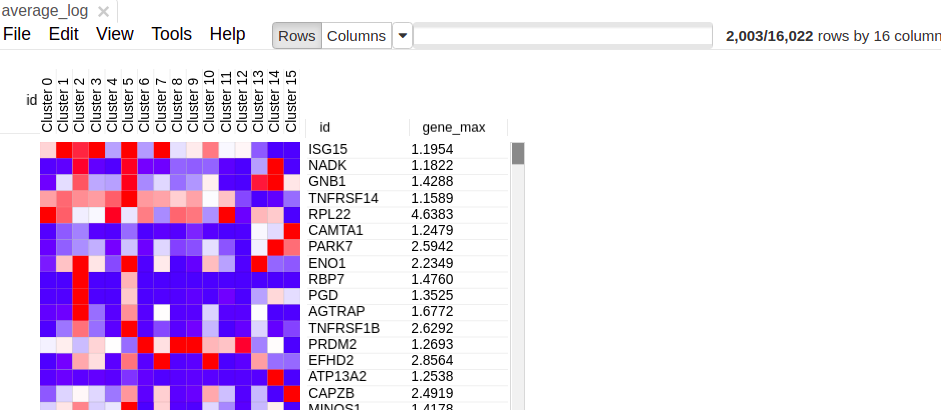

## Our setup

* Address is the same https://ctlab.itmo.ru/rstudio-sbNN/
* Folder scrna-seq
* File advanced-annotation.R

---
## Lets first load the object

```{r message=F, warning=F}
library(Seurat)
library(Matrix)
library(MAST)
library(ggplot2)
library(dplyr)
library(fgsea)

seurat <- readRDS("blood_seurat.rds")

```

---

## Calculating averaged expression

```{r message=F, warning=F}
average <- AverageExpression(seurat)$SCT
averageLog <- log2(as.matrix(average) + 1)
colnames(averageLog) <- paste0("Cluster ", colnames(average))
write.table(averageLog, "average_log.tsv", sep="\t", col.names=NA, quote=F)
```


---

## Phantasus

* Phantasus that you used yesterday for bulk RNA-seq can be used for single-cell
* We will look at averaged expression within the clusters
* https://ctlab.itmo.ru/phantasus/

Feedback is welcome!

---
## Lets do it

* Download average_log.tsv -> Open it in phantasus
* More -> Export

.center[

]

---
## Lets do it

* Download average_log.tsv -> Open it in phantasus (https://ctlab.itmo.ru/phantasus/)
* Open dataset -> My computer -> average_log.tsv

.center[

]

---
## Lets open averaged table in phantasus

.center[

]

---

## Tools -> create calculated annotation

.center[

]

---

## Tools -> create calculated annotation

.center[

]

---

## Filter out some genes

* Lets filter genes by average expression
* Tools -> Filter (Add, field = gene_max, switch to top, amount = 2000, close)

.center[

]

---

## Filtered matrix looks like this

.center[

]

---

## Lets look at some immunological markers

* Lets search for these genes: 
CD19 CD79A CD79B CD14 CD3E GNLY PRF1 FCGR3A SELL CCR7 ITGAX ITGAM HLA-DRA CD8A CD8B CD4 PTPRC

.center[

]

---

## Let's cluster

* Then tools -> clustering -> hierarchical clustering -> Cluster (columns)

.center[

]

---

## Now we can tell "who is who"

* You can adjust the height of the clustering 

.center[

]

---
# Cell lineage defines similarity of clusters
.tiny[.pull-left[
* Clusters 2, 5 are CD14+ monocytes (based on CD14 expression), and cluster 13 are CD16 (FCGR3a expression). Cluster 2, 5 and 13 are from myeloid cell lineage (3 clusters on the left)
* Clusters 6, 8 and 9 are B cell based on CD79 expression (3 clusters in the middle)
* Clusters 0, 1, 3, 4, 7, 10, 11, 12 are T cells and NK cells (CD3 and cytotoxic markers)
* Clusters 14 and 15 are some sort of outliers
]]

.pull-right[
.center[

]
]


---

## Saving heatmaps

* Create new heatmap only of selected genes (Ctrl + X)
* Saving heatmaps is a good thing
* File -> Save Image (Ctrl + S) -> Choose Filename -> Choose format (I prefer svg, svg can be open in browser) -> hooray

While this heatmap is not something you will necessarily put in the paper,
but it is ok for supplement or any kind of presentation where you present
single-cell RNA-seq data

---

## Differential expression

.small[
In bulk RNA-seq we compared groups of several samples (same cell type,
same condition, same treatment) between each other. In single-cell RNA-seq we will compare cell groups against each other:

* One cluster against the other
* One cluster against all the other clusters (marker identification)
* One condition against the other (almost bulk RNA-seq)
* Same cell type in different conditions
]


---

## Comparison of T cells

* Based on the previous investigation we have 2 clusters of CD8 T cells: 3 and 11, which are close to each other
* Lets figure out what’s the difference

---
## Comparison of T cells

```{r fig.height=3, fig.width=12, message=F, warning=F, fig.show='hold'}

FeaturePlot(seurat, features=c("CD3D", "CD4", "CD8A", "PRF1"), ncol = 4)
```

---
## Comparison of T cells

```{r fig.height=3, fig.width=12, message=F, warning=F, fig.show='hold'}

VlnPlot(seurat, features=c("CD3D", "CD4", "CD8A", "PRF1"), ncol = 4, pt.size = 0.02)
```

---
## Comparison of T cells

* We will compare population using differential expression
* This will generate a table with many important fields

---

## MAST test

.center[

]

---
## Differential expression

```{r message=F, warning=F, cache=T}

de_03_vs_11 <- FindMarkers(
  seurat, assay="SCT", ident.1 = 3, ident.2 = 11,
  test="MAST", logfc.threshold = 0, min.pct = 0
)
write.table(de_03_vs_11, "de_03_vs_11.tsv", sep="\t", col.names=NA, quote=F)
topGenes <- head(rownames(de_03_vs_11))

```

---
## Differential expression


```{r message=F, warning=F}
head(de_03_vs_11)
```

.tiny[
* avg_logFC - average log fold change
* p_val - p value (bad)
* p_val_adj - p value adjusted for multiple hypothesis (good)
* pct.1 - % of cell in the first group (cluster 3) that have non-zero expression values of gene
* pct.2 - % of cell in the first group (cluster 11) that have non-zero expression values of gene
]


---

## Differential expression: visualized

```{r fig.height=3, fig.width=10, message=F, warning=F, fig.show='hold'}
VlnPlot(seurat, topGenes, pt.size = 0.02, idents=c(3, 11), ncol=6)
```

---


## Differential expression

In single-cell RNA-seq we will compare cell groups against each other:
* One cluster against the other (we just did it)
* One cluster against all the other clusters (marker identification)
(we did it in the first part)


* One condition against the other (almost bulk RNA-seq)
* Same cell type in different conditions

---

## Cd8 T cell investigation

* We got two clusters, run DE and know whats different
* What's next?

---

## Pathway enrichment

By marker expression we know:
* Cluster 3 is (activated ?) Cd8 T cells
* Cluster 11 is (naïve/memory ?) Cd8 T cells

Is there a pathway that drive these transcriptional changes?

Is there a set of differentially expressed genes between these two groups?

---

## Let's save top genes

```{r }
de_03_vs_11$gene <- rownames(de_03_vs_11)

top50 <- de_03_vs_11 %>% top_n(50, avg_logFC) %>% pull(gene)
top200 <- de_03_vs_11 %>% top_n(200, avg_logFC) %>% pull(gene)
bottom50 <- de_03_vs_11 %>% top_n(50, -avg_logFC) %>% pull(gene)
bottom200 <- de_03_vs_11 %>% top_n(200, -avg_logFC) %>% pull(gene)

writeLines(top50, "top_50.txt")
writeLines(top200, "top_200.txt")
writeLines(bottom50, "bottom_50.txt")
writeLines(bottom200, "bottom_200.txt")
```

---

## msigdb

* Lets open top50.txt
* Lets search for the pathways
* http://software.broadinstitute.org/gsea/msigdb/annotate.jsp

---

## msigdb

* http://software.broadinstitute.org/gsea/msigdb/annotate.jsp


.center[

]

---

## msigdb results

* http://software.broadinstitute.org/gsea/msigdb/annotate.jsp


.center[

]


---

## GeneQuery

* Lets open top 200 genes upregulated in activated T cells
* Lets search for hits in GeneQuery
* http://artyomovlab.wustl.edu/genequery/searcher/

---

## GeneQuery

* http://artyomovlab.wustl.edu/genequery/searcher/

.center[

]

---

## GeneQuery

* http://artyomovlab.wustl.edu/genequery/searcher/

.center[

]

---

## GeneQuery

* http://artyomovlab.wustl.edu/genequery/searcher/

.center[

]

---

## GeneQuery

* http://artyomovlab.wustl.edu/genequery/searcher/

.center[

]


---

## Pathway enrichment

.center[

]

<div class="my-footer"><span>Partially taken from: https://www.pnas.org/content/102/43/15545</span></div> 

---

## FGSEA

```{r }
load("keggSymbolHuman.rdata")

ranks <- de_03_vs_11$avg_logFC
names(ranks) <- rownames(de_03_vs_11)
fgseaRes <- fgsea(pathways = keggSymbolHuman, 
                  stats = ranks,
                  minSize=15,
                  maxSize=500,
                  nperm=100000)
```

---
## FGSEA

```{r }
head(fgseaRes)

```

---

## Using fgsea

```{r }
topPathwaysUp <- fgseaRes[ES > 0 & padj < 0.01, ][head(order(pval), n=10), pathway]
topPathwaysDown <- fgseaRes[ES < 0 & padj < 0.01, ][head(order(pval), n=10), pathway]
topPathways <- c(topPathwaysUp, rev(topPathwaysDown))
```


---

## Using fgsea

```{r fig.height=4, fig.width=9, message=F, warning=F, fig.show='hold'}

plotGseaTable(keggSymbolHuman[topPathways], ranks, fgseaRes, 
              gseaParam = 0.2, colwidths = c(5, 1, 0.8, 0.8, 0.8))
```

---

## Using fgsea

```{r fig.height=4, fig.width=9, message=F, warning=F, fig.show='hold'}
plotEnrichment(keggSymbolHuman[["T cell receptor signaling pathway - Homo sapiens (human)"]],
ranks) + labs(title="T cell receptor signaling pathway - Homo sapiens (human)")
```

---

## Summary

* We have many ways to annotate gene sets, if it's hard to annotate by markers
* Differential expression is one of key ways to do that
* Once we have differential expression results we have many ways to annotate transcriptional differences with the pathways


---

## Questions?

